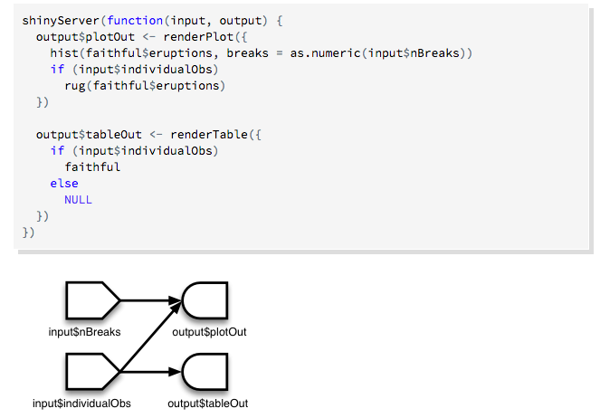
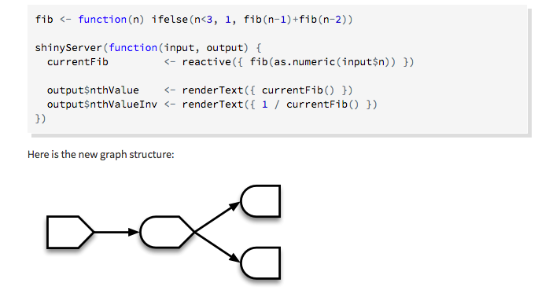

Interactive Web-based Data Visualization (1)
========================================================
author: CMSC320
date: Spring 2016


========================================================

_Politics_: [http://www.nytimes.com/interactive/2012/11/02/us/politics/paths-to-the-white-house.html?_r=0](http://www.nytimes.com/interactive/2012/11/02/us/politics/paths-to-the-white-house.html?_r=0)  

_Science_: [http://epiviz.cbcb.umd.edu/?ws=YOsu0RmUc9l](http://epiviz.cbcb.umd.edu/?ws=YOsu0RmUc9l)  

_Movies_: [http://www.nytimes.com/interactive/2013/02/20/movies/among-the-oscar-contenders-a-host-of-connections.html](http://www.nytimes.com/interactive/2013/02/20/movies/among-the-oscar-contenders-a-host-of-connections.html)

_Sports_: [http://fivethirtyeight.com/interactives/march-madness-predictions-2015/#mens](http://fivethirtyeight.com/interactives/march-madness-predictions-2015/#mens)

Why Interactivity?
========================================================
incremental: true

_Reduce data dimension_: allow user to explore large datasets by quickly switching between dimensions

_Overview first, zoom and filter, details on demand_: Provide big picture, let the user explore details as they desire

_Linked views for high dimensions_: There is a limit to the number of aesthetic mappings in a single graphic, make multiple graphics but link data objects between them

Web-based interactive visualization
======================================

Take advantage of HTML document description and the [Document Object Model](http://www.w3.org/DOM/) interface to _bind_ data to page elements.

- Shiny: bind data to controls
- Data-driven Documents (d3.js): bind data to svg elements directly

HTML and DOM
========================================================

Web pages are structured using Hypertext Markup Language


```html
<!DOCTYPE html>
<html>
  <head>
    <title>Page Title</title>
  </head>
  <body>
    <h1>Page Title</h1>
    <p>This is a really interesting paragraph.</p>
  </body>
</html>
```

Basic idea is to only specify _content_ and _structure_ but not specify directly _how_ to render pages.

HTML and DOM
==============================

Web pages are structured using Hypertext Markup Language


```html
<!DOCTYPE html>
<html>
  <head>
    <title>Page Title</title>
  </head>
  <body>
    <h1>Page Title</h1>
    <p>This is a really interesting paragraph.</p>
  </body>
</html>
```

Structure is provided by page _elements._
An important element we'll see later is the arbitrary grouping/containment element `div`.

HTML and DOM
==============================

Web pages are structured using Hypertext Markup Language


```html
<!DOCTYPE html>
<html>
  <head>
    <title>Page Title</title>
  </head>
  <body>
    <h1>Page Title</h1>
    <p>This is a really interesting paragraph.</p>
  </body>
</html>
```

The hierarchical structure of elements in a document are defined by the _Document Object Model_ (DOM).

CSS
===========================

Cascading Style Sheets are used to style elements in the DOM.

```
body {
  background-color: white;
  color: black;
}
```

In general:

```
selectorA,
selectorB,
selectorC {
  property1: value;
  property2: value;
  property3: value;
}
```

CSS
==============================

Selectors:

- Type selectors: match DOM elements by name

```
h1  /* select all level 1 headings */
p   /* select all paragraphs       */
div /* select all divs             */
```

CSS
==============================

Selectors:

- Class selectors: match DOM elements assigned to a specified class.

```
<p class="alert">You are about to become interactive</p>
<p>But you are not</p>
```

```
.alert {
  background-color: red;
  color: white;
}

SVG
===========================

Scalable Vector Graphics (SVG) is special element used to create graphics with text.

```
<svg width="50" height="50">
  <circle cx="25" cy="25" r="22" fill="blue" stroke="gray" stroke-width="2"/>
</svg>
```

SVG
================================

Elements have _geometric_ attributes and _style_ attributes.

```
<circle cx="250" cy="25" r="25"/>
```

`cx`: x-coordinate of circle center  
`cy`: y-coordinate of circle center  
`r`: radius of circle

SVG
=============================

Elements have _geometric_ attributes and _style_ attributes.

```
<rect x="0" y="0" width="500" height="50"/>
```

`x`: x-coordinate of left-top corner  
`y`: y-coordinate of left-top corner  
`width`, `height`: width and height of rectangle

SVG
==================================

_style_ attributes

```
<circle cx="25" cy="25" r="22" fill="yellow" stroke="orange" stroke-width="5"/>
```

can be styled by class as well

```
svg .pumpkin {
  fill: yellow;
  stroke: orange;
  stroke-width: 5;
}
```

```
<circle cx="25" cy="25" r="22" class="pumpkin">
```

Shiny and D3
===========================

Shiny: construct DOM and bind data (variables for example) to elements (a slide control for example)

D3: bind data to SVG element attributes (position, size, color, transparency, etc.)

Reactivity
=================

Interactivity and binding in Shiny achieved using _reactive programming_. Where objects _react_ to changes in other objects.


Reactivity
==============

Example: 



Reactivity
=================

With intermediate objects:



Reactivity
====================

A standard paradigm for interactive (event-driven) application development

A nice review paper: [http://dl.acm.org/citation.cfm?id=2501666](http://dl.acm.org/citation.cfm?id=2501666)

Binding data to graphical elements
================

So far, we have bound data objects to document elements.  
More examples: [http://shiny.rstudio.com/gallery/](http://shiny.rstudio.com/gallery/)

Next time we bind data directly to _graphical_ elements
  - since using SVG these are also document elements (D3).

